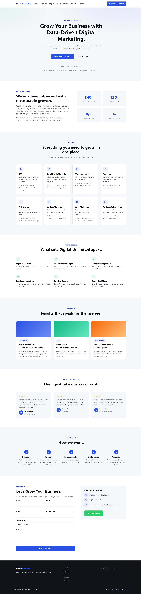

# Digital Unlimited

A one-page marketing agency website built as plain static HTML/CSS/JS — no framework, no build step, no package manager.



## Structure

The entire site is three files:

- `index.html` — all page markup
- `styles.css` — all styling
- `script.js` — all client-side behavior

The page is organized as a single scrolling document with one section per feature: Hero, About, Services, Why Us, Portfolio, Testimonials, Process, and Contact. Header and footer navigation both link to these sections via anchors.

## Features

- Sticky header
- Mobile navigation toggle
- Scroll-reveal animations (fail-safe: content stays visible if JS doesn't load)
- Animated stat counters
- Client-side contact form validation

## Running locally

There's no build tooling — just open `index.html` directly in a browser:

```powershell
Start-Process "index.html"
```

## Deployment

The site deploys automatically to GitHub Pages via a GitHub Actions workflow on push to `main`.
